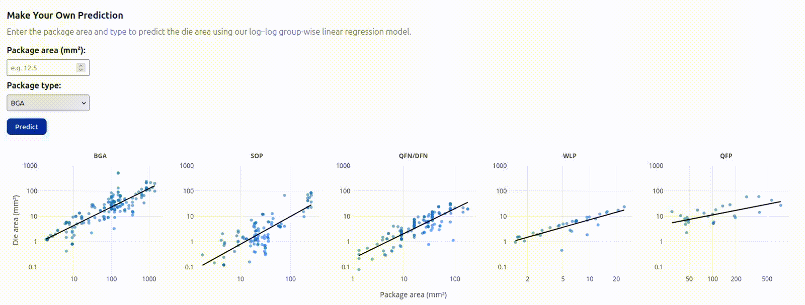

# DieAreaRegressor

<p align="center">
  <a href="#about">About</a> &nbsp;&bull;&nbsp;
  <a href="#environment-setup">Environment Setup</a> &nbsp;&bull;&nbsp;
  <a href="#important-note-about-data">Important Note About Data</a> &nbsp;&bull;&nbsp;
  <a href="#repository-structure">Repository Structure</a> &nbsp;&bull;&nbsp;
  <a href="#citation">Citation</a>
</p>

<br>
<br>

<table align="center">
<tr>
<td align="center">

<em style="color: steelblue;">
→ An <a href="https://anncollin.github.io/DieAreaPrediction/">interactive web interface</a> is available to perform silicon die area predictions without running the Jupyter notebooks locally. ←
</em>

<br><br>



</td>
</tr>
</table>

<br>
<br>

## About

This repository contains the code associated with our work on silicon die area estimation for integrated circuits used in Life-Cycle Assessment (LCA) modeling. The full paper will be available soon on ArXiv. 

---

## Environment Setup

To create and activate the Conda environment:

```bash
conda env create -f environment.yml
conda activate ossda
```

---

## Important Note About Data

The OSSDA dataset will publicly available soon. The data files are not yet included in this repository.

As a consequence:

- The Jupyter notebooks are not directly runnable at this stage.  
- All notebook outputs are stored and can be viewed.  
- A `data/` folder will be added in a future update.

---

## Repository Structure

This repository contains multiple Jupyter notebooks corresponding to the analysis workflow presented in the paper.

> ### 00_extractDataset.ipynb
>
> Provides utilities to:
>
> - Load and preprocess the OSSDA dataset  
> - Perform exploratory data analysis  
> - Compute and display descriptive statistics  
>
>
>
>### 01_chooseBestModel.ipynb
>
>Implements the model selection pipeline:
>
> - K-fold cross-validation  
> - Comparison of regression models  
> - Selection of the recommended log-log group-wise linear regression model  
>
> Cross-validation runs used in the paper are stored in the `CVRuns/` folder.
>
> You may run new experiments if desired.
>
>
>
> ### 02_observeBestModel.ipynb
>
> Provides utilities to:
>
> - Load the selected regression model  
> - Evaluate prediction performance  
> - Visualize regression results  
> - Compare estimation approaches  
>
---

## Citation

The full citation of the associated publication will be added soon.
